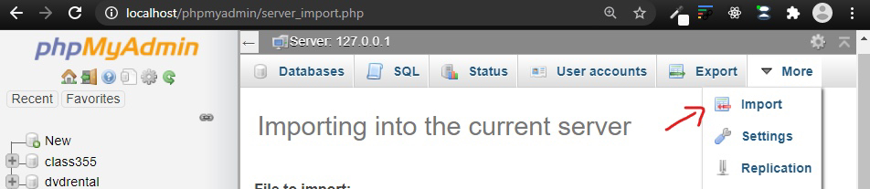
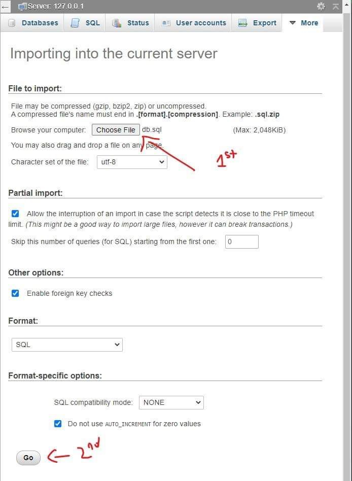
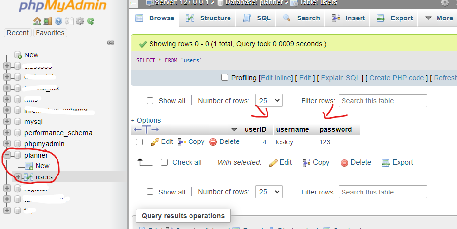

# CIS Registration Assistant

## Live Hosted

To view the live hosted version of this repository click on [this](https://cisc4900.herokuapp.com/) link.

## Local Installation Guide

1. To run the application locally, you will need to download the source code & install **XAMPP Control Panel** using [this](https://www.apachefriends.org/download.html) link.

2. You will then need to copy the **CISC4900_SP21** folder into the path:

```
C:\xampp\htdocs
```

3. Run **XAMPP** and click *Start for Apache and MySQL*

4. Click **Admin** for *MySQL* and follow the screenshots below to setup the database:







5. Click **Admin** for *Apache* and this will open a webpage:

```
http://localhost/dashboard/
```

Change the URL to:

```
http://localhost/CISC4900_SP21
```

6. From here you can click on the **src** folder to test the application.
